# CNN Meat Classification

<div align="center">

**Dự án phân loại thịt tươi và thịt hỏng bằng mô hình CNN tự xây dựng từ đầu với PyTorch, Grad-CAM và web demo FastAPI.**

<br/>


</div>

---

## 1. Project Title & Catchphrase

**CNN Meat Classification** là dự án phân loại ảnh thịt thành hai lớp: **Fresh** và **Spoiled**.

Dự án xây dựng pipeline đầy đủ từ xử lý dữ liệu, loại ảnh trùng, chia train/validation/test, huấn luyện CNN tự xây dựng, đánh giá mô hình, trực quan hóa Grad-CAM và triển khai web demo bằng FastAPI.

> Dự án phục vụ mục đích học tập, nghiên cứu và demo AI. Kết quả dự đoán chỉ mang tính tham khảo, không thay thế quy trình kiểm định chất lượng thực phẩm trong thực tế.

---

## 2. Quick Demo & Visuals

<div align="center">

[Dataset Kaggle](https://www.kaggle.com/datasets/tanhphp/meatmeat-quality-classification) ·
[Source Code](https://github.com/franceto/CNN-Meat-Classification) ·
[FastAPI Web Demo](#)

<br/><br/>

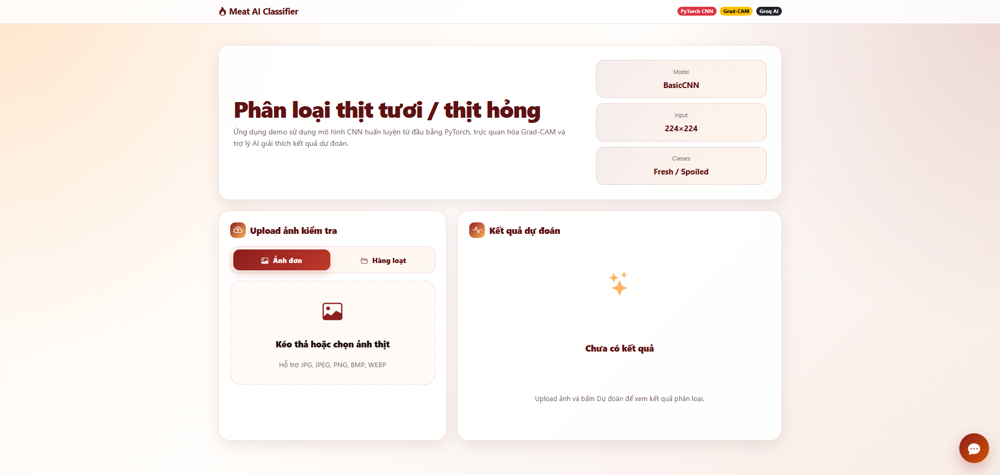
<br/><br/>
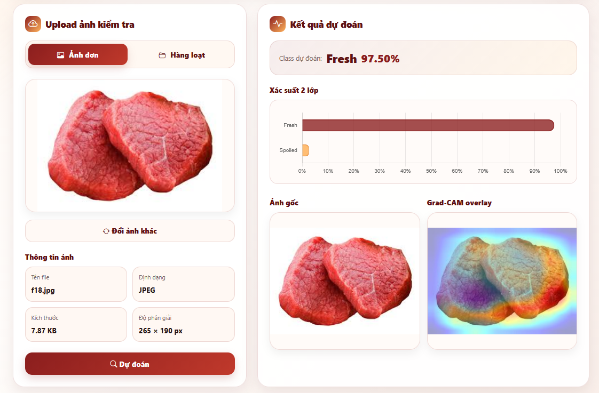
<br/><br/>
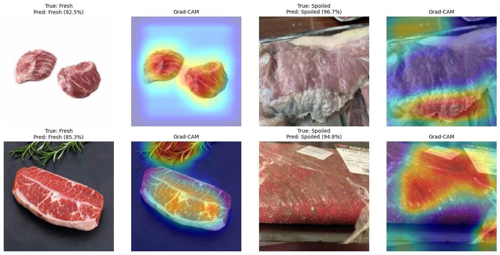

</div>

---

## 3. Tính Năng Nổi Bật

- **Phân loại ảnh thịt 2 lớp:** nhận diện ảnh thuộc nhóm `Fresh` hoặc `Spoiled`.
- **CNN tự xây dựng từ đầu:** không dùng pretrained model và không dùng transfer learning.
- **Kiểm soát data leakage:** loại ảnh trùng bằng hash trước khi chia dữ liệu.
- **Grad-CAM:** trực quan hóa vùng ảnh mô hình tập trung khi dự đoán.
- **Web demo FastAPI:** hỗ trợ dự đoán ảnh đơn, dự đoán hàng loạt, upload `.zip`, `.rar`, folder ảnh và xuất báo cáo PDF.
- **AI chat bằng Groq API:** hỗ trợ giải thích kết quả dự đoán và Grad-CAM trong giao diện demo.

---

## 4. Công Nghệ Sử Dụng

<div align="center">


</div>

### Thành phần kỹ thuật

| Nhóm | Công nghệ | Vai trò |
|---|---|---|
| Deep Learning | PyTorch, TorchVision | Xây dựng, huấn luyện và suy luận mô hình CNN |
| Xử lý ảnh | Pillow, OpenCV | Đọc ảnh, resize, tạo Grad-CAM overlay |
| Phân tích dữ liệu | NumPy, Pandas | Thống kê dữ liệu và lưu kết quả thực nghiệm |
| Đánh giá mô hình | scikit-learn | Accuracy, classification report, confusion matrix |
| Trực quan hóa | Matplotlib, Seaborn, Chart.js | Biểu đồ EDA, training curve và xác suất dự đoán |
| Web backend | FastAPI, Uvicorn | API dự đoán ảnh, batch prediction và download PDF |
| Web frontend | HTML, CSS, JavaScript, Bootstrap Icons | Giao diện demo người dùng |
| Giải thích mô hình | Grad-CAM | Trực quan hóa vùng ảnh ảnh hưởng đến dự đoán |
| Báo cáo | ReportLab | Sinh báo cáo PDF cho dự đoán hàng loạt |
| AI assistant | Groq API | Chatbot giải thích kết quả và Grad-CAM |

---

## 5. Triển Khai Nhanh

**Prerequisites**

- Python 3.x
- Git
- Kaggle API nếu muốn tải dataset bằng CLI
- GPU NVIDIA nếu muốn huấn luyện nhanh hơn
- 7-Zip nếu muốn dùng file `.rar` cho dự đoán hàng loạt
- File model final nếu chỉ muốn chạy demo: `artifacts/models/basic_cnn_final.pt`

```bash
# Clone repository
git clone https://github.com/franceto/CNN-Meat-Classification.git
cd CNN-Meat-Classification

# Tạo và kích hoạt môi trường ảo trên Windows PowerShell
py -m venv .venv
.\.venv\Scripts\Activate.ps1

# Cập nhật pip
python -m pip install -U pip

# Cài thư viện phụ thuộc
pip install -r requirements.txt

# Nếu muốn dùng PyTorch CUDA 12.6
pip install torch torchvision torchaudio --index-url https://download.pytorch.org/whl/cu126

# Tải dataset từ Kaggle
kaggle datasets download -d tanhphp/meatmeat-quality-classification -p data/raw --unzip

# Chạy web demo FastAPI
uvicorn app.main:app --reload
```

Mở trình duyệt tại:

```text
http://127.0.0.1:8000
```

---

## 6. Tài Liệu Dự Án

### Bài toán

| Thành phần | Mô tả |
|---|---|
| Input | Ảnh thịt |
| Output | `Fresh` hoặc `Spoiled` |
| Task | Binary image classification |
| Model | BasicCNN tự xây dựng từ đầu |
| Pretrained | Không sử dụng |
| Transfer learning | Không sử dụng |
| Demo | FastAPI web app |
| Giải thích mô hình | Grad-CAM |

### Dataset

Nguồn dữ liệu chính: [MeatMeat quality classification - Kaggle](https://www.kaggle.com/datasets/tanhphp/meatmeat-quality-classification)

Cấu trúc dữ liệu sau khi tổ chức:

```text
Dataset-Meat/
├── Fresh/
└── Spoiled/
```

Sau khi kiểm tra và loại bỏ ảnh trùng lặp, bộ dữ liệu dùng cho huấn luyện gồm 745 ảnh.

| Split | Fresh | Spoiled | Tổng |
|---|---:|---:|---:|
| Train | 338 | 183 | 521 |
| Validation | 73 | 39 | 112 |
| Test | 73 | 39 | 112 |

### Hình ảnh dữ liệu

<div align="center">

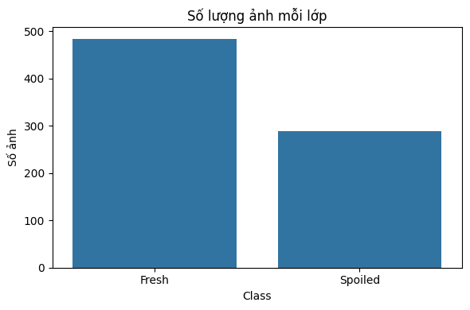
<br/><br/>
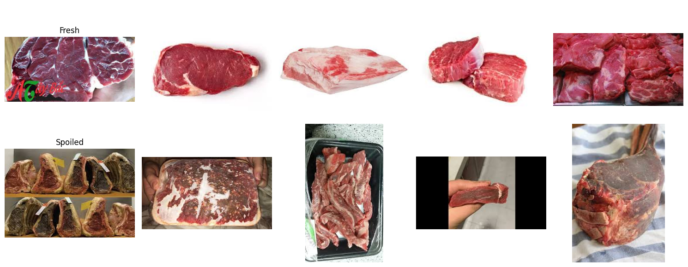
<br/><br/>
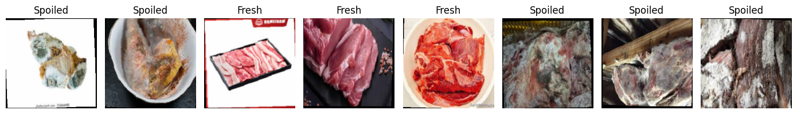

</div>

### Tiền xử lý và tăng cường dữ liệu

| Bước | Mô tả |
|---|---|
| Kiểm tra ảnh | Đọc toàn bộ ảnh và loại ảnh lỗi nếu có |
| Loại trùng | Dùng hash để phát hiện và di chuyển ảnh trùng lặp |
| Split dữ liệu | Chia train/validation/test theo tỷ lệ 70/15/15 và giữ tỷ lệ lớp |
| Resize | Chuẩn hóa input về 224 x 224 |
| Normalize | Tính mean/std trên tập train để tránh data leakage |
| Augmentation | Chỉ áp dụng tăng cường hình học nhẹ, hạn chế thay đổi màu sắc thịt |

Cấu hình augmentation final trên tập train:

```python
transforms.Resize((240, 240))
transforms.RandomResizedCrop(224, scale=(0.94, 1.0), ratio=(0.97, 1.03))
transforms.RandomHorizontalFlip(p=0.5)
transforms.RandomVerticalFlip(p=0.1)
transforms.RandomRotation(3)
transforms.RandomAffine(degrees=0, translate=(0.02, 0.02), scale=(0.97, 1.03), shear=1)
transforms.RandomPerspective(distortion_scale=0.03, p=0.08)
```

### Mô hình

Mô hình final là **BasicCNN** tự xây dựng từ đầu.

| Thành phần | Cấu hình |
|---|---|
| Model | BasicCNN |
| Input size | 224 x 224 |
| Số lớp đầu ra | 2 |
| Activation | SiLU |
| Regularization | Dropout2D, Dropout |
| Số tham số | 758.434 |
| Loss | Weighted CrossEntropyLoss |
| Optimizer | AdamW |
| Scheduler | Warmup 5 epochs + Cosine decay |
| Mixed precision | AMP nếu CUDA khả dụng |
| Checkpoint | Chỉ lưu best và last |

Kiến trúc tổng quát:

```text
Input image
-> ConvBN + MaxPool
-> ConvBN + MaxPool
-> ConvBN + MaxPool
-> Dropout2D
-> ConvBN + MaxPool
-> Dropout2D
-> ConvBN
-> AdaptiveAvgPool2D
-> Dropout
-> Linear classifier
-> Fresh / Spoiled
```

### Quá trình thực nghiệm

| Thực nghiệm | Model | Split | Augmentation | Cân bằng dữ liệu | Loss | Scheduler | Params | Best Val Acc |
|---|---|---|---|---|---|---|---:|---:|
| Exp 01 | BasicCNN / AdvancedCNN / CBAM-TinyViT | 80/10/10 | Resize 256, RandomResizedCrop 224, flip, rotation, color jitter, blur | Class weight | Weighted CrossEntropy | ReduceLROnPlateau | 389K / 3.65M / 965K | 0.9189 |
| Exp 02 | BasicCNN | 70/15/15 | Resize 256, RandomResizedCrop 224, flip, rotation, color jitter, blur | Class weight | Weighted CrossEntropy | CosineAnnealingLR | 758K | 0.9286 |
| Exp 03 | BasicCNN residual | 70/15/15 | Resize 240, crop, flip, affine, perspective | Class weight | Weighted CrossEntropy | Warmup + Cosine | khoảng 2.8M | 0.9554 |
| Exp 04 | BasicCNN + EMA | 70/15/15 | Resize 240, crop, flip, affine, perspective | Class weight | Weighted CrossEntropy | Warmup + Cosine | 758K | 0.9286 |
| Exp 05 | CNN residual + SE attention | 70/15/15 | Resize 240, crop, flip, affine, perspective | WeightedRandomSampler + class weight | Focal Loss | Warmup + Cosine | 2.81M | 0.9286 |
| Exp 06 - Final | BasicCNN | 70/15/15 | Resize 240, RandomResizedCrop scale=(0.94,1.0), ratio=(0.97,1.03), HorizontalFlip, VerticalFlip, Rotation, Affine, Perspective | Class weight | Weighted CrossEntropy | Warmup + Cosine | 758K | 0.9464 |

Mô hình final được chọn vì cân bằng tốt giữa độ chính xác, độ ổn định, kích thước mô hình và khả năng triển khai web demo.

### Kết quả huấn luyện và đánh giá

<div align="center">

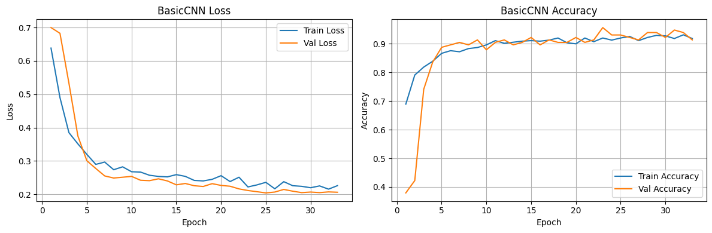

</div>

| Metric | Giá trị |
|---|---:|
| Test Accuracy | 0.9018 |
| Macro F1 | 0.89 |
| Weighted F1 | 0.90 |

Classification report trên tập test:

```text
              precision    recall  f1-score   support

       Fresh       0.93      0.92      0.92        73
     Spoiled       0.85      0.87      0.86        39

    accuracy                           0.90       112
   macro avg       0.89      0.89      0.89       112
weighted avg       0.90      0.90      0.90       112
```

Confusion matrix trên test nội bộ:

| True / Pred | Fresh | Spoiled |
|---|---:|---:|
| Fresh | 67 | 6 |
| Spoiled | 5 | 34 |

### Đánh giá bổ sung trên dataset công khai khác nguồn

| Thiết lập | Accuracy | Fresh Recall | Spoiled Recall |
|---|---:|---:|---:|
| Threshold mặc định 0.50 | 0.6403 | 1.0000 | 0.2806 |
| Threshold calibration trên public validation | 0.9177 | 1.0000 | 0.8354 |

Kết quả này cho thấy mô hình có thể gặp domain shift khi dữ liệu kiểm thử khác nguồn so với dữ liệu huấn luyện. Threshold calibration giúp tăng độ nhạy với lớp Spoiled, nhưng không được dùng tùy tiện trong demo final vì threshold quá thấp có thể khiến ảnh Fresh bị cảnh báo sai trong một số tình huống.

### Web demo

Các chức năng chính:

- Upload ảnh đơn và hiển thị thông tin ảnh.
- Dự đoán Fresh/Spoiled kèm độ tin cậy.
- Hiển thị biểu đồ xác suất hai lớp.
- Hiển thị ảnh gốc và Grad-CAM overlay song song.
- Upload hàng loạt bằng file `.zip`, `.rar` hoặc folder ảnh.
- Xuất báo cáo PDF cho dự đoán hàng loạt.
- Floating AI chat sử dụng Groq API để giải thích kết quả.

<div align="center">


<br/><br/>

<br/><br/>

<table>
  <tr>
    <td align="center">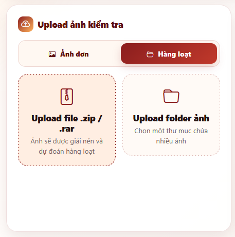</td>
    <td align="center">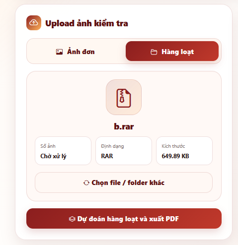</td>
    <td align="center">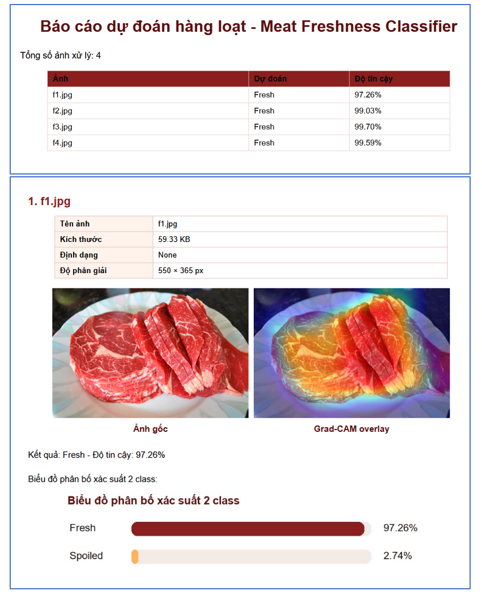</td>
  </tr>
  <tr>
    <td align="center">Chọn chế độ hàng loạt</td>
    <td align="center">Upload file hoặc folder</td>
    <td align="center">Báo cáo PDF</td>
  </tr>
</table>

<br/>

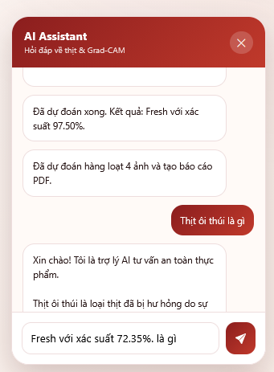

</div>

### Cấu trúc dự án

```text
CNN-Meat-Classification/
├── app/
│   ├── main.py
│   ├── services/
│   │   ├── model_service.py
│   │   ├── batch_service.py
│   │   └── groq_service.py
│   ├── static/
│   │   ├── css/
│   │   │   └── style.css
│   │   ├── js/
│   │   │   └── app.js
│   │   └── outputs/
│   └── templates/
│       └── index.html
├── notebooks/
├── src/
│   ├── di_class.png
│   ├── meat.png
│   ├── agu_train.png
│   ├── result.png
│   ├── predict.png
│   ├── overview.png
│   ├── pre_single.png
│   ├── ui_batch.png
│   ├── ui_batch_loadfile.png
│   ├── report_pdf.png
│   └── ai_chat.png
├── requirements.txt
├── .gitignore
└── README.md
```

Các thư mục và file không nên push lên GitHub:

```text
data/
artifacts/models/
artifacts/checkpoints/
app/static/outputs/
.env
kaggle.json
```

### Cấu hình Kaggle API

Tải `kaggle.json` từ tài khoản Kaggle và đặt tại:

```text
C:\Users\<YOUR_USERNAME>\.kaggle\kaggle.json
```

Kiểm tra Kaggle API:

```powershell
kaggle datasets list
```

Tải dataset:

```powershell
kaggle datasets download -d tanhphp/meatmeat-quality-classification -p data/raw --unzip
```

Sau khi tải, cần tổ chức dữ liệu về dạng:

```text
data/raw/Dataset-Meat/
├── Fresh/
└── Spoiled/
```

Không commit file `kaggle.json` lên GitHub.

### Huấn luyện mô hình

Quy trình huấn luyện được thực hiện trong notebook:

```text
notebooks/
```

Thứ tự xử lý khuyến nghị:

```text
1. Kiểm tra GPU và CUDA
2. Import thư viện
3. Load dataset
4. EDA dữ liệu
5. Tìm và loại ảnh trùng lặp
6. Chia train/validation/test
7. Tính mean/std và tạo transform
8. Data augmentation
9. Cấu hình hyperparameter
10. Xây dựng BasicCNN
11. Huấn luyện và lưu best checkpoint
12. Vẽ loss/accuracy
13. Đánh giá test set
14. Lưu model final
```

Model final sau khi huấn luyện được lưu tại:

```text
artifacts/models/basic_cnn_final.pt
```

Do model weights không được push lên GitHub, để chạy demo trên máy mới cần tự huấn luyện lại hoặc đặt file model final vào đúng đường dẫn trên.

### Chạy ứng dụng web

Tạo file `.env` ở thư mục gốc nếu muốn dùng AI chat:

```env
GROQ_API_KEY=your_groq_api_key_here
GROQ_MODEL=llama-3.1-8b-instant
```

Chạy FastAPI:

```powershell
uvicorn app.main:app --reload
```

Mở trình duyệt:

```text
http://127.0.0.1:8000
```

Nếu dùng file `.rar` cho dự đoán hàng loạt, cần cài 7-Zip và đảm bảo lệnh `7z` có trong PATH.

### Git ignore khuyến nghị

```text
.venv/
data/
artifacts/models/
artifacts/checkpoints/
app/static/outputs/
.env
kaggle.json
__pycache__/
.ipynb_checkpoints/
*.pyc
*.pt
*.pth
*.zip
*.rar
```

### Lưu ý sử dụng

- Repository không bao gồm dataset, model weights, checkpoint, file `.env` hoặc Kaggle API token.
- Mô hình được huấn luyện trong phạm vi dataset của dự án, kết quả có thể thay đổi nếu ảnh khác điều kiện chụp, ánh sáng, loại thịt hoặc nền ảnh.
- Grad-CAM chỉ cho biết vùng ảnh mô hình tập trung nhiều hơn, không chứng minh mô hình luôn dự đoán đúng bản chất sinh học của thịt.
- Với dữ liệu thực tế, nên dùng thêm kiểm tra cảm quan, quy trình bảo quản và tiêu chuẩn an toàn thực phẩm phù hợp.
- Không dùng kết quả mô hình như kết luận chính thức về an toàn thực phẩm.

### Tác giả

**Franceto (ANH PHAP TO)**  
GitHub: [https://github.com/franceto](https://github.com/franceto)

### License

Repository hiện chưa khai báo license cụ thể. Nếu muốn public open-source chính thức, nên bổ sung file `LICENSE`, ví dụ MIT License hoặc Apache-2.0.

### Support

Nếu dự án hữu ích, hãy cho repository một sao.

Made by **Franceto (ANH PHAP TO)**
